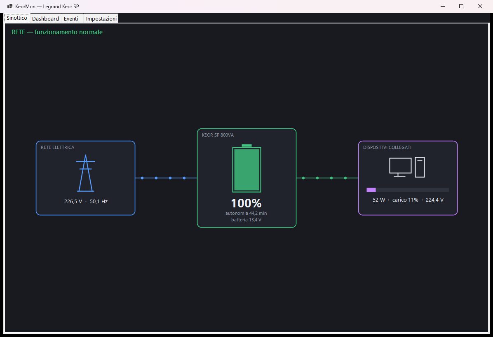
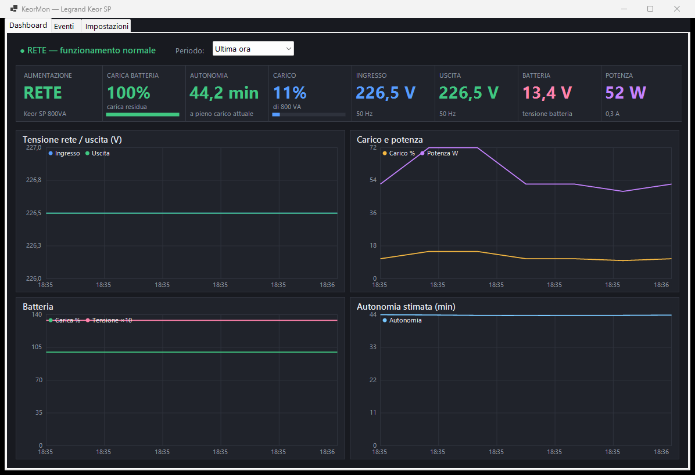
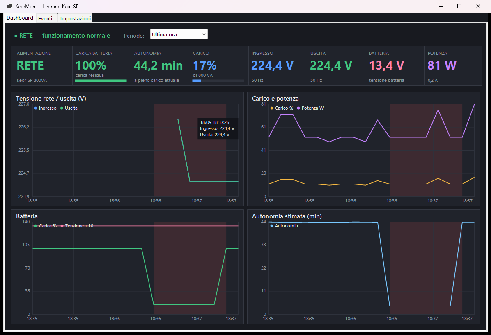

# Legrand Keor SP UPS — unofficial Windows monitor

> **UNOFFICIAL PROJECT** — not affiliated with, endorsed by, or connected to
> Legrand in any way. See the [Disclaimer](#disclaimer--no-warranty) below.

A complete Windows utility for the **Legrand Keor SP** UPS connected over USB
(HID Power Device, VID `0x0665` / PID `0x5161`). Verified on a Keor SP 800VA.





## What it does

- **Windows service** (`KeorMon`, LocalSystem, automatic start): samples the UPS,
  stores history, raises alerts and executes the configured critical action —
  **even with no user logged in**. It reloads its settings automatically when you
  save them from the GUI.
- **Tray app + dashboard** (starts at logon): live tiles, history charts, event log
  and settings. When the service is running, the tray only displays and notifies —
  the service owns history and the critical action.
- **Animated synoptic view**: mains → UPS → connected devices, with energy-flow
  animation driven by the measured load. The battery content animates phone-style:
  rising wave + lightning bolt while charging, downward sweep while discharging.
  On battery the remaining runtime is highlighted.
- **SQLite history** (`C:\ProgramData\KeorMon\keormon.db`, shared by service and
  GUI): smooth spline charts with sample markers, selectable window (1 hour to
  30 days), on-battery intervals shaded in red.
- **Alerts**: system notifications for mains lost/restored, warning and critical
  thresholds on charge and runtime, overload. All events are stored and browsable.
- **Configurable critical action** once the critical state persists past a grace
  period: **hibernate** (default), **shut down**, or **simulate only** (logged and
  notified, never executed). Switching from simulation to a real action asks for
  confirmation.
- **Recharge estimate**: minutes-to-full computed from the recent charge trend
  (the firmware exposes no such value).
- **Writable UPS parameters**: transfer thresholds, audible alarm (2 = on,
  3 = mute), capacity warning threshold, battery-test command. Parameters that arm
  the UPS output shutdown (`DelayBefore*`) are flagged as dangerous and require an
  extra explicit confirmation.
- **Freeze watchdog**: the UPS's measurement processor can stop refreshing data
  toward USB (all values frozen bit-for-bit); the app detects it and recovers with
  a harmless wake-up write.
- **Localized in 20 languages** (auto-detected from the OS, selectable in
  Settings): English, Italiano, 中文 (Chinese), हिन्दी (Hindi), Español, Français,
  العربية (Arabic), বাংলা (Bengali), Português, Русский (Russian), اردو (Urdu),
  Bahasa Indonesia, Deutsch, 日本語 (Japanese), मराठी (Marathi), తెలుగు (Telugu),
  Türkçe, தமிழ் (Tamil), Tiếng Việt, 한국어 (Korean). Missing strings fall back to
  English.

## Requirements

- Windows 10/11
- [.NET 8 Desktop Runtime](https://dotnet.microsoft.com/download/dotnet/8.0)
  (SDK needed only to build)
- Legrand Keor SP connected via USB

## Build

This is open source: **you are free — and encouraged — to review the entire source
code before building and running it.**

```powershell
cd src/KeorMon
dotnet publish -c Release -o ..\..\bin
```

## Install

From an **elevated** (administrator) PowerShell in the repository root:

```powershell
.\Install-KeorMon.ps1
```

This registers and starts:

| Component | How it runs |
|---|---|
| `KeorMon` Windows service | `KeorMon.exe --service`, LocalSystem, automatic start, restart on failure |
| `KeorMon Tray` scheduled task | tray icon + dashboard at every logon of the current user |

Shared data lives in `C:\ProgramData\KeorMon\` (`config.json`, `keormon.db`,
`keormon.log`).

## Uninstall

```powershell
.\Install-KeorMon.ps1 -Uninstall
```

Stops and removes the service and the tray task. Data in `C:\ProgramData\KeorMon\`
is left in place; delete that folder to remove history and settings too.

## Usage

```powershell
# one reading printed to the terminal (shows the app version)
.\bin\KeorMon.exe --once

# tray + dashboard (delegates history/critical action if the service is running)
.\bin\KeorMon.exe

# headless monitor in a console (debugging)
.\bin\KeorMon.exe --worker
```

Manage the service with the standard tools: `Get-Service KeorMon`,
`Restart-Service KeorMon`.

### Testing the critical path

Settings → **Test critical scenario (simulated)** forces the on-battery state with
charge/runtime below the critical thresholds. After the grace period the critical
action fires (simulated if configured so). Press the button again to stop. For a
full end-to-end test, unplug the UPS from the wall: detection, alerts, history
shading and the configured action all run against the real hardware.

## Protocol notes

The Keor SP firmware exposes a standard HID Power Device collection (usage page
0x84) but its report-descriptor unit/exponent metadata is unreliable, so values
are decoded from raw feature reports through an explicit report map
(`src/KeorMon/Ups/UpsReportMap.cs`). Verified scaling: voltages ×0.1 (2-byte
reports), frequencies ×0.1, battery voltage ×0.1 (1 byte), runtime in seconds,
`0xFF`/`0xFFFF` = not set. Mains presence comes from
`Win32_Battery.BatteryStatus` (1 = on battery, 2 = on AC) cross-checked against
the measured input voltage. Writes go through `HidD_SetFeature`; the firmware
acks immediately but reflects the new value in the feature report only after
~1–3 s, so write verification polls the readback. The measurement processor can
freeze its data toward the USB bridge; a harmless SetFeature write wakes it up
(field-verified).

PowerShell prototypes of the same protocol live in the repository root
(`Read-Ups.ps1`, `UpsHid.psm1`, `UpsMonitor.ps1`) — useful for scripting or
exploring the reports without the app.

## Roadmap

- Home Assistant integration (MQTT discovery published by the service)

## Disclaimer — no warranty

**This is an unofficial, independent, community project.**

- The author of this software **holds no rights whatsoever over the Legrand name,
  brand, logos, or products**. "Legrand" and "Keor" are trademarks of their
  respective owners, used here solely to identify the hardware the software
  interoperates with.
- The author **has no affiliation, association, sponsorship, endorsement, or any
  other connection with Legrand** or any of its subsidiaries. Legrand has not
  reviewed, approved, or contributed to this project in any way.
- This software is provided **"AS IS", without warranty of any kind**, express or
  implied, including but not limited to the warranties of merchantability, fitness
  for a particular purpose, and non-infringement. **Correct operation is not
  guaranteed.**
- **The author accepts no responsibility or liability for any damage** — direct,
  indirect, incidental, or consequential — including but not limited to data loss,
  hardware damage, unexpected shutdowns or hibernations, missed shutdowns during a
  power failure, or damage to equipment connected to the UPS, arising from the use
  or inability to use this software.
- This software can **write configuration parameters to the UPS** and can
  **hibernate or shut down your computer**. Review the thresholds and the critical
  action before relying on it, and test the behavior in simulation mode first.
- The project is **open source**: everyone is free — and encouraged — to inspect,
  audit, and verify the source code before compiling and using it. **Use it
  entirely at your own risk. No warranty of any kind is provided.**
